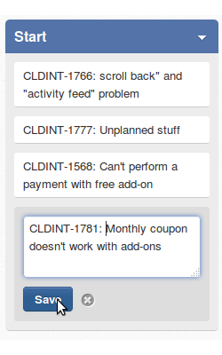

Codefest 2014 team A repository
===========

# The team A

TEAM MEMBER | EXO TEAM
------------ | ------------- 
Nguyen Anh Vu | PLF/ECMS
Nguyen Truong Giang | UI
Le Thi Thu Ha | PLF/ECMS
Dang Thi May | PLF/ECMS

# How to build

	git clone git@github.com:exo-codefest/2014-team-A.git
	cd 2014-team-A
	mvn clean install

# Overview
* Name: Tasks Management Add-on
* Purposes: Provide an effective tool which facilitates users to manage personal and group projects, tasks and is integratable easily to Platform

# Definitions
- A project could have a member (personal project) or many members (group project)
- A project is organized in many tasks
- One or many members in project are going to be assigned to perform tasks
- A task could have many state (open, inprogress, pending, done, etc.). The state of tasks is updated by members.
- States are configurable and customizable by users.
- Only members of a project can see the project and its tasks on his board.

# Done features
- Create new projects
- Add members to project
- Search projects
- Add new state/task to project
- Configure Tasks (name, assignees, due date, attachments, type, etc.)
- Change state of task
- Search task
- Remove task from project

# How to use
- Access to Tasks Management Add-on by clicking on "Tasks Management" item on left side menu after you logged into Platform
- A list of your projects is displayed on main page. The toolbar at the top allows you to add new project or search project by keyword

Add new project

Search project

- Click on project to go to detail page of that project. You can add new State for project by clicking on button "Add New State" on toolbar. Depending on how you define states of your tasks, a set of states can be created for ex: Open, In Progress, Done, etc. Or Startup, Develop, Review, Experiment, etc. States can be reordered by drag and drop State columns.

- When you want to add members for projects, click on triangle icon on right top corner, search and add users here to your project.

- Tasks are displayed in State columns depends on their state. You are able to add new task, change state of task by drag and drop it on expected state, search task by keyword (the result will be highlight in State columns), edit task information (description, dependencies, performer, type, etc.) and remove task by click on Close icon beside each task. Here are some screenshot for illustration

Add new task

Drag and drop task to another state

Search task by keyword

Edit task information

State

# Improvements
Because development time is quite limited so we decided to implement the add-on as a "proof of concept" with basic functions. The add-on certainly could evolve more with many interesting and potential features. We list some perspectives below:
* Notification for members by email
* Import projects and tasks from other system (Trello, basecamp, google, etc.)
* Search tasks and projects with advaned filter
* Export statistics data which can be used for progress report of project
